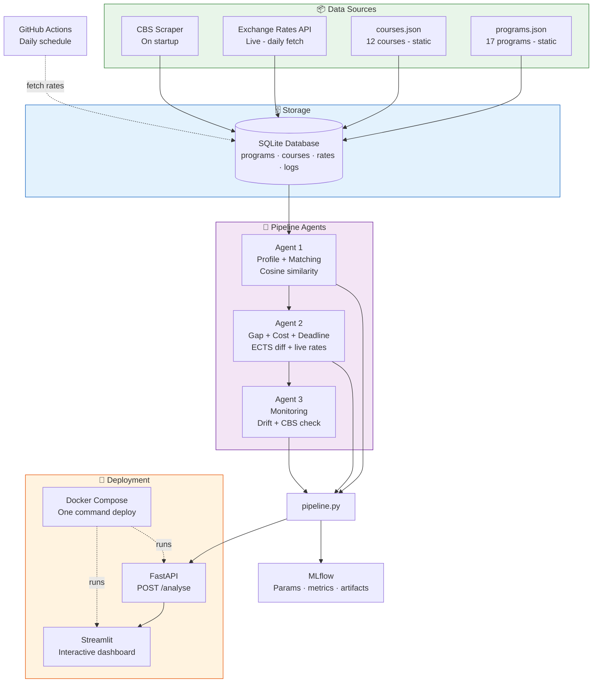

# 🎓 StudyBuddy DK
### AI-Powered Danish Master's Program Finder
**MSc BDS — Data Engineering and Machine Learning Operations in Business**  
**Student:** Alina Shrestha | **Submitted:** April 2026

---

## 📌 What is this project?

StudyBuddy DK is an end-to-end MLOps pipeline that helps international students find the right Danish master's program. A student enters their academic profile and the system returns:

- **Top 3 matching programs** from 6 Danish universities (CBS, DTU, KU, AAU, AU, SDU)
- **Skill gap analysis** — what's missing and how to fix it
- **Cost estimates** in DKK, NPR, INR and USD using live exchange rates
- **Deadline countdowns** calculated automatically every day
- **Monitoring alerts** for data drift and requirement changes

Everything is tracked in MLflow for full reproducibility.

---

## 🏗️ Pipeline Architecture



| Layer | Technology |
|---|---|
| Static data | `programs.json` (17 programs) + `courses.json` (12 courses) |
| Live data | Exchange rates API (frankfurter.app + open.er-api.com) |
| Database | SQLite via `database.py` |
| Agent 1 | Profile building + cosine similarity matching + eligibility |
| Agent 2 | Gap analysis + course recommendations + cost calculation + deadlines |
| Agent 3 | Exchange rate drift monitoring + CBS requirement scraping |
| API | FastAPI (`api.py`) — POST `/analyse` endpoint |
| Frontend | Streamlit (`app_final.py`) — interactive dashboard |
| Tracking | MLflow — logs every run with parameters, metrics and artifacts |
| Scheduling | GitHub Actions — daily exchange rate fetch |
| Container | Docker + Docker Compose |

---

## 🚀 Quick Start

### Option 1 — Run with Docker (recommended)

```bash
# Clone the repository
git clone https://github.com/alina1999shrestha-blip/studybuddy-dk.git
cd studybuddy-dk

# Create .env file with your API key
echo ANTHROPIC_API_KEY=your_key_here > .env

# Build and run everything
docker-compose up --build
```

Then open:
- **Streamlit dashboard:** http://localhost:8501
- **FastAPI docs:** http://localhost:8000/docs
- **MLflow UI:** http://localhost:5000

### Option 2 — Run locally (Windows)

```bash
# 1. Clone the repo
git clone https://github.com/alina1999shrestha-blip/studybuddy-dk.git
cd studybuddy-dk

# 2. Create virtual environment with Python 3.11
python -m venv venv311
venv311\Scripts\activate

# 3. Install dependencies
pip install -r requirements.txt

# 4. Create .env file
echo ANTHROPIC_API_KEY=your_key_here > .env

# 5. Set up database
python database.py

# 6. Run the full pipeline test
python pipeline.py

# 7. Start FastAPI (Terminal 1)
python api.py

# 8. Start Streamlit (Terminal 2)
streamlit run app_final.py

# 9. Start MLflow UI (Terminal 3)
python -m mlflow ui --backend-store-uri mlflow_tracking
```

---

## 📁 Project Structure


| Folder / File | Purpose |
|---|---|
| `agents/` | 3 pipeline agents — matching, gaps, monitoring |
| `data/static/` | 17 programs + 12 courses JSON files |
| `.github/workflows/` | GitHub Actions daily exchange rate fetch |
| `pipeline.py` | Connects all 3 agents end to end |
| `api.py` | FastAPI REST backend |
| `app_final.py` | Streamlit interactive dashboard |
| `database.py` | SQLite database setup |
| `mlflow_tracker.py` | MLflow experiment logging |
| `Dockerfile` | Container definition |
| `docker-compose.yml` | One command deployment |
| `requirements.txt` | Python dependencies |
| `.env` | API keys — never committed to GitHub |

---

## 🔌 API Endpoints

| Method | Endpoint | Description |
|---|---|---|
| GET | `/` | API info and status |
| GET | `/health` | Health check |
| POST | `/analyse` | Run full pipeline with student profile |
| GET | `/programs` | List all 17 programs |
| GET | `/courses` | List all 12 courses |
| GET | `/exchange-rates` | Latest exchange rates |
| GET | `/pipeline-runs` | Recent pipeline run history |
| GET | `/monitoring-alerts` | Latest monitoring alerts |

### Example API call:

```bash
curl -X POST http://localhost:8000/analyse \
  -H "Content-Type: application/json" \
  -d '{
    "name": "Alina Shrestha",
    "degree": "BBA Finance",
    "ects_business": 90,
    "ects_quantitative": 30,
    "ects_programming": 15,
    "ects_research": 30,
    "ielts": 6.5,
    "country": "Nepal",
    "eu_student": false
  }'
```

---

## 📊 MLflow Tracking

Every pipeline run logs:

**Parameters:** student name, degree, country, IELTS, ECTS breakdown  
**Metrics:** match score, gaps found, tuition in DKK/NPR/INR, days to deadline  
**Artifacts:** 5 JSON files per run (profile, matches, gaps, costs, alerts)

View the MLflow UI:
```bash
python -m mlflow ui --backend-store-uri mlflow_tracking
# Open http://localhost:5000
```

---

## 🤖 LLM Component

The system includes an AI-powered transcript reader using the Anthropic Claude API. Students can upload a photo of their university transcript and the system automatically:
1. Reads all courses from the image
2. Categorises them into Business / Quantitative / Programming / Research
3. Converts credits to ECTS automatically
4. Pre-fills the analysis form

This requires an `ANTHROPIC_API_KEY` in your `.env` file.

---

## ⚙️ GitHub Actions

The workflow `.github/workflows/daily_rates.yml` runs every day at 08:00 UTC and:
1. Fetches latest DKK exchange rates (NPR, INR, USD, EUR, GBP)
2. Saves them to the database
3. Logs the update to MLflow

---

## 🐳 Docker Setup

```bash
# Build and start all services
docker-compose up --build

# Stop all services
docker-compose down

# Rebuild after code changes
docker-compose up --build --force-recreate
```

Services started:
- `studybuddy-api` → FastAPI on port 8000
- `studybuddy-frontend` → Streamlit on port 8501

---

## 📋 Requirements

- Python 3.11+
- Docker + Docker Compose
- Anthropic API key (for transcript reader feature)

---

## 📜 License

MIT License — see [LICENSE](LICENSE) for details.

---

*StudyBuddy DK | Alina Shrestha | MSc BDS MLOps Assignment | April 2026*
